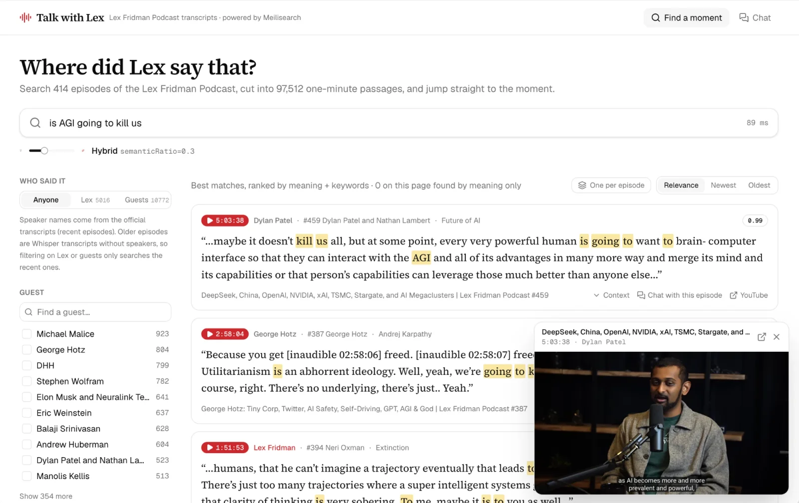

# Talk with Lex

Every Lex Fridman Podcast transcript, cut into one-minute passages and indexed in Meilisearch. Find
*where* someone said something and jump to that second of the video, or ask questions and get answers
with a timestamped link for every claim.

**Live demo: [talk-with-lex.vercel.app](https://talk-with-lex.vercel.app)**



## What you can do

- **Find a moment.** Type a quote, an idea, or a name. Put a phrase in double quotes (`"love is the answer"`) to find
  it word for word. Every result starts with its timestamp; press it to play the video from that second.
- **Search by meaning.** Every search blends keywords and meaning: `afraid to die` finds conversations about
  mortality that never use those words. Results found by meaning get a red border; hover a score to see why it ranked.
- **Filter by speaker.** Keep only what Lex said, or only his guests, and narrow down to one or more guests.
- **One result per episode.** Group results so each episode appears once with its best moment, then open
  "+N more moments in this episode" to see the rest.
- **Read the conversation around a hit.** Expand the passages just before and after, like reading the transcript.
- **Chat with the archive.** Ask "What does Lex think love is?" and the model searches the transcripts on its own,
  shows the searches it ran and the passages it read, and cites the exact second for each claim. You can also chat
  with a single episode.

## Meilisearch features

| In the app | Meilisearch capability |
|---|---|
| `"love is the answer"` finds the exact moments | Phrase search, highlighting, and cropping |
| Keywords + meaning, scores on hover | [Hybrid search](https://www.meilisearch.com/docs/capabilities/hybrid_search/overview) (`semanticRatio: 0.5`) with a HuggingFace embedder (`BAAI/bge-small-en-v1.5`) running inside Meilisearch, and `showRankingScoreDetails` to tell keyword hits from semantic ones |
| Who said it: Lex or guests, with counts | Filter on `isLex`, counts from facets |
| Guest list with type-ahead | Facets and facet search |
| Newest and oldest | Sort on `episodeNumber` |
| "Episodes with …" suggestions above the results | Multi-search (`chunks` and `episodes` in one request) |
| One per episode, "+N more moments in this episode" | `distinct` on `episodeId`, plus a facet-only query for per-episode counts |
| Conversation around a hit | Filter `episodeId = … AND position X TO Y`, sorted by `position` |
| Chat with timestamped citations | [Conversational search](https://www.meilisearch.com/docs/capabilities/agentic_search/overview) with the `/chats` API: the LLM calls a hybrid search tool and streams its progress and sources |
| Chat with one episode | Tenant token whose search rule filters `episodeId = …` |

## The data

414 episodes, 97,512 passages, 9.9M words.

| Source | Episodes | Speaker names | Chapters |
|---|---|---|---|
| Official transcripts on [lexfridman.com](https://lexfridman.com/podcast/) | 71 recent ones (mostly #387 to #502) | Yes | Yes |
| [Whispering-GPT/lex-fridman-podcast](https://huggingface.co/datasets/Whispering-GPT/lex-fridman-podcast) on HuggingFace (Whisper) | 343 (#1 to #345) | No | From the YouTube outline |

Episodes #346 to about #386 are missing because neither source covers them. The official transcript wins when
both sources have the same episode.

Passages are about one minute of speech (110 to 190 words), split on sentence boundaries, and never mix two
speakers. Each passage keeps its episode, guest, speaker, chapter, and start time, so a result can link to
`youtube.com/watch?v=…&t=…s`.

## How it works

- **Two indexes.** `chunks` holds the passages (the unit you search, filter, and cite). `episodes` holds one
  document per episode for guest suggestions and episode details.
- **The browser never sees an API key.** Search goes through Next.js API routes that use a read-only key. For chat,
  the server hands the browser a 30-minute tenant token derived from a chat key, and the browser streams straight
  from Meilisearch's `/chats` endpoint. Chatting with one episode is the same token with a search rule, so the model
  can only retrieve passages from that episode.
- **All Meilisearch configuration lives in one file:** [`web/scripts/setup-meilisearch.ts`](web/scripts/setup-meilisearch.ts)
  (settings, synonyms, embedder, chat workspace and prompts).

## Run it locally

Requires Docker and Node 24.

```bash
cp .env.example .env              # add CHAT_API_KEY for the chat page
docker compose up -d meilisearch
cd web && pnpm install
pnpm data:fetch                    # lexfridman.com + HuggingFace -> data/ (~2 min, downloads cached in data/raw)
pnpm data:setup                    # settings, import (~20 s), chat workspace, then embeddings in the background
cd .. && docker compose watch      # web app with live sync
```

- App: http://localhost:3110
- Meilisearch: http://localhost:7710, master key in `.env`

Keyword search works as soon as the import finishes. Semantic search and chat switch on when the embedding
task is done, which takes about 80 minutes on CPU with the local HuggingFace model. For a faster setup, set
`EMBEDDER_SOURCE=openAi` and `EMBEDDER_API_KEY` (`text-embedding-3-small`, about 13M tokens, roughly $0.30).

### Chat LLM

The `/chats` workspace needs an LLM. Set these in `.env`, then run `pnpm data:setup` again:

```
CHAT_SOURCE=openAi        # openAi | mistral | gemini | azureOpenAi | vLlm
CHAT_API_KEY=sk-...
CHAT_MODEL=gpt-4o-mini
CHAT_BASE_URL=            # required for mistral (https://api.mistral.ai/v1) and vLlm
```

To use a non-OpenAI model through an OpenAI-compatible gateway (for example Claude behind LiteLLM or a similar
proxy), use `CHAT_SOURCE=vLlm`. With `openAi`, Meilisearch sends the system prompt with the `developer` role for
models not named like an older GPT, which Anthropic and Mistral reject.

## Deploy on a shared instance

The live demo runs next to other indexes on an existing Meilisearch instance, with the front end on Vercel.

**1. Pick index names.** Every name is configurable, so the demo does not collide with anything else:

```
MEILI_CHUNKS_INDEX=lex-chunks
MEILI_EPISODES_INDEX=lex-episodes
CHAT_WORKSPACE=talk-with-lex
```

**2. Ship the embeddings instead of recomputing them.** Embedding ~100k passages takes over an hour of CPU. Compute
them once locally, then import them with `regenerate: false` so the target instance never re-embeds:

```bash
cd web
pnpm data:export-vectors          # local instance -> data/chunks-with-vectors.ndjson (~450 MB)
MEILI_HOST=https://your-instance MEILI_MASTER_KEY=... \
MEILI_CHUNKS_INDEX=lex-chunks MEILI_EPISODES_INDEX=lex-episodes CHAT_WORKSPACE=talk-with-lex \
CHAT_SOURCE=... CHAT_BASE_URL=... CHAT_API_KEY=... CHAT_MODEL=... \
node scripts/setup-meilisearch.ts
```

When `data/chunks-with-vectors.ndjson` exists, the setup script configures the embedder first, then sends the
documents with their vectors in gzipped batches. The whole import takes a few minutes.

**3. Create two scoped keys.** The app never needs the master key:

| Key | Actions | Indexes | Env vars |
|---|---|---|---|
| Server key | `search`, `documents.get`, `settings.get`, `stats.get`, `tasks.get` | both indexes | `MEILI_API_KEY` |
| Chat key | `search`, `chatCompletions` | chunks index | `MEILI_CHAT_KEY`, `MEILI_CHAT_KEY_UID` |

**4. Deploy the front end** from `web/` (Vercel or any Next.js host) with `MEILI_HOST`, `MEILI_PUBLIC_URL`, the index
names, the two keys, and `CHAT_MODEL`. Until the indexes exist, the site shows "The transcripts are being loaded"
and retries on its own.

Things to know:

- **Meilisearch refuses private and loopback LLM URLs** for chat ("Rejected IP"). If the LLM gateway runs on the same
  machine, point the workspace at its public URL.
- **A HuggingFace embedder downloads its model on first use.** The instance needs working outbound access to
  huggingface.co. If that connection hangs, the settings task hangs with it, and so does the task queue behind it.
- **Tasks on a busy instance run in order.** The import waits behind other indexes' tasks.

## Demo script

1. Search `"love is the answer"`: 7 exact moments across episodes. Press a timestamp to play that second.
2. Search `meaning of life` and choose **Lex**: only Lex's own questions, from the recent episodes.
3. Turn on **One per episode**, then open "+18 more moments in this episode" on the George Hotz result.
4. Type `Dostoyevski`: typo tolerance still finds Dostoevsky.
5. Slide towards meaning and search `afraid to die`: passages about mortality that never use those words.
6. On a result, open **Context**, then **Chat with this episode** and ask for a five-bullet summary.
7. On the chat page, ask "What does Lex think love is?" and follow the timestamped citations.

## Project layout

```
compose.yaml                        Meilisearch + web (Next.js dev server with compose watch)
data/                               generated dataset (git-ignored); data/raw caches downloads
web/scripts/fetch-transcripts.ts    scrape, parse, and chunk the transcripts
web/scripts/setup-meilisearch.ts    all Meilisearch configuration
web/scripts/export-vectors.ts       dump passages with their embeddings for another instance
web/src/app/api/                    search (multi-search), context, facet-search, episodes, status,
                                    chat-token (tenant token; the browser calls /chats directly)
web/src/app/                        UI: search page, floating YouTube player, chat page
```

The transcripts belong to their authors and come from public sources. This project is a Meilisearch demo and is not
affiliated with the Lex Fridman Podcast.
